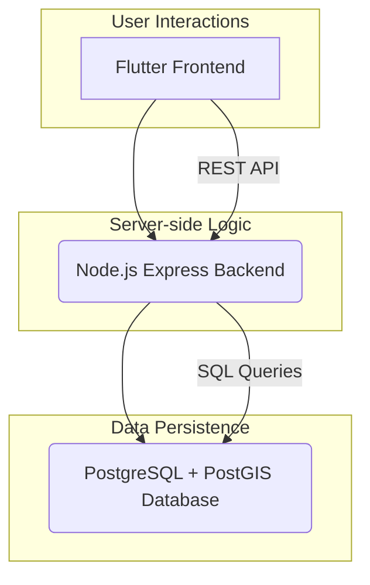

# 💧 Einhod Pure Water - Comprehensive Project Documentation

## 🚀 1. Project Overview

The Einhod Pure Water Management System is a comprehensive solution designed to streamline water delivery operations, manage client and worker profiles, handle inventory, track deliveries, and provide administrative oversight. The project aims to deliver a highly premium, delightful user experience through modern UI/UX principles and intelligent features.

**Primary Goal**: To transform a functional app into a robust, secure, and user-centric platform with a focus on premium user experience, intelligent features, and operational efficiency.

**Key Features**:
*   Multi-role support (Client, Delivery Worker, Onsite Worker, Administrator, Owner).
*   Water delivery request and tracking.
*   User and profile management.
*   Subscription and coupon book management.
*   Worker scheduling, leaves, and expense tracking.
*   Real-time GPS tracking for delivery workers.
*   Analytics and reporting dashboard for administrators.
*   Comprehensive notification system.
*   Bilingual support (English & Arabic).
*   Premium UX elements: Liquid loading, Glassmorphism, Haptic feedback, AI-powered predictions, Confetti celebrations.

## 🏗️ 2. Architecture

The system employs a client-server architecture, comprising a Flutter mobile/web frontend, a Node.js Express backend, and a PostgreSQL database with PostGIS extensions.



**Communication Flow**:
*   The Flutter Frontend communicates with the Node.js Express Backend primarily via **RESTful API calls** over HTTP/HTTPS.
*   The Node.js Backend interacts with the PostgreSQL Database using **SQL queries** (managed via the `pg` library).

**Deployment Strategy**:
*   **Backend**: Deployed to Render, configured to automatically build and run the Node.js application.
*   **Frontend**: Designed for mobile (Android/iOS APKs) and web deployment. Android APKs are built using `flutter build apk --release`.

## 💻 3. Tech Stack

### 3.1. Backend (Node.js)

*   **Runtime**: Node.js (>=18.0.0)
*   **Framework**: Express.js
*   **Database**: PostgreSQL (with PostGIS for geospatial features)
*   **ORM/Driver**: `pg` (node-postgres)
*   **Authentication**: JSON Web Tokens (JWT) for stateless authentication, `bcrypt` for secure password hashing.
*   **Security**: `helmet` (security headers), `cors` (CORS management), `express-rate-limit` (request rate limiting).
*   **Validation**: `express-validator` for API input validation.
*   **Logging**: `winston` for structured and centralized logging.
*   **Environment**: `dotenv` for managing environment variables.
*   **Scheduled Tasks**: `node-cron` for background jobs.
*   **Other**: `axios` (HTTP client), `pg-hstore`.
*   **Development**: `nodemon` (live reloading), `jest` (testing), `supertest` (API testing), `eslint` (linting).

### 3.2. Frontend (Flutter)

*   **Framework**: Flutter 3.x
*   **Language**: Dart 3.x
*   **State Management**: `flutter_riverpod` (Provider-based reactive state management).
*   **Navigation**: `go_router` (declarative routing).
*   **HTTP Client**: `dio` (powerful HTTP client).
*   **UI/UX**: Material 3 Design principles.
*   **Premium UX Libraries**:
    *   `flutter_animate`: Declarative animations for UI elements.
    *   `confetti`: Celebration animations.
    *   `shimmer`: Skeleton loading effects.
*   **Localization**: `flutter_localizations` with ARB files for English and Arabic.
*   **Storage**: `shared_preferences` (simple key-value), `flutter_secure_storage` (secure key-value).
*   **Location**: `geolocator`, `geocoding`.
*   **Notifications**: `flutter_local_notifications`.
*   **Other**: `google_fonts`, `flutter_svg`, `cached_network_image`, `fl_chart`.

## 🧑‍💻 4. User Roles & Permissions

The system supports multiple distinct user roles, each with specific permissions and access levels, enforced by a robust Role-Based Access Control (RBAC) mechanism.

**Defined Roles**:
*   `owner`
*   `administrator`
*   `delivery_worker`
*   `onsite_worker`
*   `client`

**Enforcement**:
*   **Database**: Each user in the `users` table has a `role` column of type `user_role[]` (an array of ENUMs), allowing for multiple roles per user.
*   **Backend (JWT)**: User roles are embedded in the JWT payload as a `roles` array during login (`auth.controller.js`).
*   **Backend (Middleware)**: The `auth.middleware.js` uses `authorizeRoles` to check if a user's `roles` array (from their JWT) includes any of the `allowedRoles` for a given route.
*   **Frontend (Router)**: The `go_router` logic in Flutter (`app_router.dart`) redirects users to their appropriate home screen (`/admin/home`, `/worker/home`, `/client/home`) based on the roles stored in `StorageService`.

## 🗄️ 5. Backend Deep Dive

The Node.js Express backend is designed for scalability, security, and maintainability.

### 5.1. Structure (`src` directory)

```
src/
├── config/                  # Database connection, API endpoints configuration
├── controllers/             # Business logic for each API endpoint
├── middleware/              # Authentication, authorization, validation middleware
├── routes/                  # API route definitions
├── services/                # Background tasks, external integrations (cron, notifications)
├── utils/                   # Helper functions (logger, roles, i18n, state machine)
├── server.js                # Main Express application entry point
```

### 5.2. Security

*   **Authentication**:
    *   **Password Hashing**: Uses `bcrypt` (with configurable rounds via `BCRYPT_ROUNDS` env var) for secure, one-way password hashing.
    *   **JWT**: `jsonwebtoken` is used to issue short-lived access tokens and longer-lived refresh tokens. JWT secrets and expiry times are securely managed via environment variables (`JWT_SECRET`, `JWT_REFRESH_SECRET`).
    *   **Password Reset**: Implements a secure password reset flow using time-limited, 6-digit verification codes.
    *   **In-Memory Tokens**: Refresh tokens and verification codes are currently stored in-memory. For production, these should be moved to a persistent, scalable store like Redis to ensure persistence across server restarts and better scalability.
*   **Authorization (RBAC)**:
    *   **Middleware**: `src/middleware/auth.middleware.js` provides `authenticateToken` and `authorizeRoles` functions. Routes are protected by specifying required roles (`authorizeRoles('administrator', 'owner')`).
    *   **Resource Ownership**: `authorizeOwnerOrAdmin` middleware prevents users from accessing or modifying data they do not own, unless they are an admin.
*   **Input Validation**: `express-validator` is extensively used at the **route level** (e.g., `src/routes/*.routes.js`) for all incoming API data. This prevents common vulnerabilities like SQL injection, XSS, and ensures data integrity.
*   **SQL Injection Prevention**: All database interactions utilize parameterized queries (prepared statements) via the `pg` library, which is the primary and most effective defense against SQL injection.
*   **Express Security**:
    *   `helmet`: Sets various HTTP headers to prevent common web vulnerabilities (e.g., XSS, clickjacking).
    *   `cors`: Configured to allow requests only from specified origins (via `CORS_ORIGIN` env var).
    *   `express-rate-limit`: Protects against brute-force attacks and DDoS by limiting request frequency. Configured with `app.set('trust proxy', 1)` for correct operation behind reverse proxies like Render.
*   **Environment Variables**: All sensitive information (DB credentials, API keys, JWT secrets) is loaded from `.env` files using `dotenv`, never hardcoded.

### 5.3. Data Handling

*   **Database Connection (`src/config/database.js`)**:
    *   Uses `pg` (node-postgres) with a connection pool for efficient database resource management.
    *   Supports both `DATABASE_URL` (for cloud providers) and individual connection parameters.
    *   Includes a custom parser for PostgreSQL `user_role[]` array types, ensuring correct data interpretation.
    *   Configured with connection timeouts and max pool size.
    *   **SSL Configuration**: Currently `rejectUnauthorized: false` for `DATABASE_URL` to ease cloud deployment. For strict production, this should be `true` with proper certificate validation.
*   **Query Helpers**: Provides `query` for standard queries and `transaction` for atomic, multi-statement operations. `getClient` is available for more complex scenarios.
*   **Transactions**: Extensively used in controllers (e.g., `admin.controller.js`, `worker.controller.js`, `delivery.controller.js`) to maintain data consistency and integrity for multi-step operations (e.g., creating users, completing deliveries, updating client balances).

### 5.4. Error Handling & Logging

*   **Global Error Handler**: `src/server.js` includes a global Express error-handling middleware that catches unhandled exceptions, logs them with `winston`, and returns a generic 500 Internal Server Error (with stack trace in development).
*   **Specific Error Handling**: Controllers return specific HTTP status codes (400, 401, 403, 404, 500) with clear messages for different error scenarios.
*   **Logging (`src/utils/logger.js`)**:
    *   Utilizes `winston` for robust, structured logging.
    *   Logs are categorized by level (`info`, `warn`, `error`, `debug`).
    *   Output to console (colorized) and files (`error.log`, `combined.log`) with size rotation.
    *   Configurable log level via `LOG_LEVEL` environment variable.
    *   **Consistency Issue**: During review, noted some controllers inconsistently use `console.error` instead of the configured `logger.error`. This should be unified.

### 5.5. Key Services & Logic

*   **Cron Jobs (`src/services/cron.service.js`)**: Manages scheduled background tasks.
*   **Notification Service (`src/services/notification.service.js`)**: Handles sending notifications (internal/external).
*   **Role Utilities (`src/utils/roles.js`)**: Provides helper functions (`hasAnyRole`, `isAdmin`, etc.) for consistent role-based checks.
*   **State Machine (`src/utils/state-machine.js`)**: Enforces valid transitions for statuses (e.g., delivery status, coupon request status).

## 📱 6. Frontend Deep Dive (Flutter)

The Flutter frontend is built for a premium, responsive, and intuitive user experience across mobile and web platforms.

### 6.1. Structure (`lib` directory)

```
lib/
├── core/                    # Core functionalities (config, network, providers, router, services, theme, utils, widgets)
├── features/                # Domain-specific features (admin, auth, client, location, notifications, worker)
├── l10n/                    # Localization files (ARB, generated Dart files)
├── models/                  # Data models for the application
├── screens/                 # Top-level screen widgets (e.g., login, admin/client/worker home)
├── theme/                   # Application theme definitions (colors, typography, spacing)
├── widgets/                 # Reusable shared UI widgets
├── main.dart                # Application entry point
```

### 6.2. State Management & Navigation

*   **State Management**: `flutter_riverpod` is used for managing application state. Providers expose data and logic to UI components efficiently.
*   **Navigation**: `go_router` provides declarative routing, enabling deep linking and complex navigation flows. The `appRouterProvider` handles redirect logic based on user authentication status and roles.

### 6.3. API Integration

*   `dio`: Used as the HTTP client for all API interactions with the Node.js backend.
*   `AuthService`: Manages user login, logout, token refresh, and password management, interfacing with the backend's authentication routes.

### 6.4. Premium UX Features

The application incorporates several advanced UI/UX enhancements:

*   **Liquid Loading Animations**: Custom-painted, morphing water droplet effects (e.g., `LiquidLoadingIndicator`).
*   **Glassmorphism UI Elements**: Frosted glass effects for cards and overlays (`GlassCard`).
*   **Neumorphic Buttons**: Soft, tactile button designs (planned but not fully implemented).
*   **Contextual Animations**: Staggered fade-ins and slides for lists using `flutter_animate`.
*   **Skeleton Screens with Shimmer**: Content-aware loading placeholders (e.g., `DeliveryCardSkeleton`, `HeroCardSkeleton`) provide a smoother perceived loading experience.
*   **Haptic Feedback System**: Contextual tactile feedback for interactions (e.g., button presses, success/error states).
*   **AI-Powered Delivery Predictions**: Analyzes past usage to suggest future delivery dates and quantities (`AIPredictionService`, `SmartDeliverySuggestion`).
*   **Smart Notifications**: Enhanced notification cards with actions, optimized for user engagement.
*   **Celebration Moments**: Confetti animations for significant events (e.g., successful delivery request).

### 6.5. Localization

*   **Bilingual Support**: Fully localized for English (`en`) and Arabic (`ar`).
*   **Implementation**: Uses `flutter_localizations` with ARB (Application Resource Bundle) files (`app_en.arb`, `app_ar.arb`). Translations are accessed via `AppLocalizations.of(context)!`.
*   **RTL Support**: The Flutter framework inherently supports Right-to-Left (RTL) layouts, crucial for Arabic.

## 📊 7. Database Schema Overview (PostgreSQL + PostGIS)

The database schema is designed to support the complex operations of a water delivery management system.

**Key Tables**:
*   **`users`**: Stores user authentication details (username, password_hash, `role user_role[]`, `is_active`).
*   **`client_profiles`**: Client-specific information (full_name, address, subscription_type, remaining_coupons, `current_debt`, `home_latitude`, `home_longitude`).
*   **`worker_profiles`**: Worker-specific details (full_name, worker_type, `vehicle_current_gallons`, `gps_sharing_enabled`).
*   **`delivery_requests`**: Client-initiated requests (priority, requested_gallons, status, assigned_worker_id).
*   **`deliveries`**: Records of actual deliveries (delivery_date, actual_delivery_time, gallons_delivered, empty_gallons_returned, `delivery_location GEOGRAPHY(POINT, 4326)`).
*   **`scheduled_deliveries`**: Recurring delivery schedules.
*   **`notifications`**: Stores system-generated notifications for users.
*   **`payments`**: Records of all payment transactions.
*   **`worker_expenses`**: Worker-submitted expenses.
*   **`coupon_sizes`**: Configuration for coupon book packages (size, price, bonus_gallons).
*   **`filling_stations`**: Information about water filling stations.
*   **`dispensers`**: Management of physical water dispensers.
*   **`worker_locations`**: Real-time worker GPS locations (`latitude`, `longitude`, `updated_at`).

**Key ENUMs**: `user_role`, `subscription_type`, `delivery_priority`, `delivery_status`, `dispenser_status`, `payment_method`, `payment_status`, `expense_payment_method`, `expense_status`, `station_status`, `notification_category`.

**PostGIS Usage**: The `GEOGRAPHY(POINT, 4326)` type is used for storing precise GPS coordinates (e.g., client home locations, delivery locations, worker live locations) and enables advanced geospatial queries (e.g., `get_nearby_clients`, `calculate_distance`).

## ⚙️ 8. Development & Deployment

### 8.1. Quick Start

**Backend (Node.js)**:
1.  Ensure Node.js (>=18.0.0) and npm (>=9.0.0) are installed.
2.  Install PostgreSQL and create a database named `einhod_water`.
3.  Copy `.env.example` to `.env` and fill in your database credentials and JWT secrets.
4.  Run database setup and seeding: `npm run db:setup` (creates schema) and `npm run db:seed` (populates with test data).
5.  Install dependencies: `npm install`
6.  Start the server: `npm start` (or `npm run dev` for development with `nodemon`).

**Frontend (Flutter)**:
1.  Ensure Flutter SDK (3.x) and Dart SDK (3.x) are installed.
2.  Navigate to the Flutter project root: `cd einhod-water-flutter`
3.  Get dependencies: `flutter pub get`
4.  Generate localization files: `flutter gen-l10n`
5.  Run the app: `flutter run`

### 8.2. Backend Deployment (Render)

The backend is configured for deployment on Render:
*   **Repository**: `https://github.com/KhaledJamahneh/nodejscode`
*   **Build Command**: `npm install` (Render automatically uses `package.json` at root).
*   **Start Command**: `npm start` (Render uses `scripts.start` from `package.json`).
*   **Environment Variables**: Configured directly in Render's environment settings.
*   **Database**: Connects to an external PostgreSQL service (e.g., Neon).
*   **`trust proxy`**: Explicitly set in `src/server.js` for correct rate-limiting.

### 8.3. Frontend Deployment (APK / App Stores)

*   **Android APK**: Built using `flutter build apk --release`. The resulting APK is found in `einhod-water-flutter/build/app/outputs/flutter-apk/app-release.apk`.
*   **App Stores**: For production deployment to Google Play Store or Apple App Store, further configuration (signing, app store listings) would be required.

## ⚠️ 9. Known Issues & Future Improvements

### 9.1. Backend

*   **Transitive Dependency Vulnerabilities**: High-severity `tar` vulnerabilities (sub-dependency of `bcrypt` via `@mapbox/node-pre-gyp`) persist even after `npm audit fix --force`. Risk is mitigated as `tar` is used for native module compilation, not runtime processing of untrusted input. Future `bcrypt` or `jest`/`supertest` upgrades might resolve this.
*   **In-Memory Token/Code Storage**: Refresh tokens and password reset verification codes are currently stored in-memory (`Set`, `Map`). For production, these require persistent and scalable storage (e.g., Redis) to survive server restarts and support load balancing.
*   **Password Reset SMS**: The backend logs password reset codes to console. A robust SMS service (e.g., Twilio) needs integration for production use.
*   **Hardcoded Configuration**: Some values (e.g., price per gallon, distance thresholds) are currently hardcoded in business logic; moving these to system settings (database) or environment variables would improve configurability.
*   **Route Duplication/Consistency**: For `schedule`, `shifts`, and `coupon-sizes` routes, there is redundancy where a single controller is mounted multiple times (e.g., in `admin.routes.js` and a dedicated route file). Refactoring for clearer routing is recommended for maintainability.
*   **Placeholder Routes**: `gps.routes.js` and `notification.routes.js` are currently placeholders. They will require full implementation, input validation, and authorization upon development.
*   **Database SSL**: `rejectUnauthorized: false` for `DATABASE_URL` in `src/config/database.js` should be set to `true` in production with proper certificate validation.
*   **`schedule.controller.js` - `client_id` Array Bug**: The `createSchedule` function may have a bug where it attempts to insert an array into a singular `client_id` column, which needs to be verified and fixed.

### 9.2. Frontend

*   **Neumorphic Buttons**: Identified in the UX roadmap, but not fully implemented.
*   **Advanced Features**: Phase 3 UX improvements (Voice Commands, AR features, Gamification, etc.) are planned but not yet implemented.

## 📄 10. License

Proprietary - Einhod Pure Water
